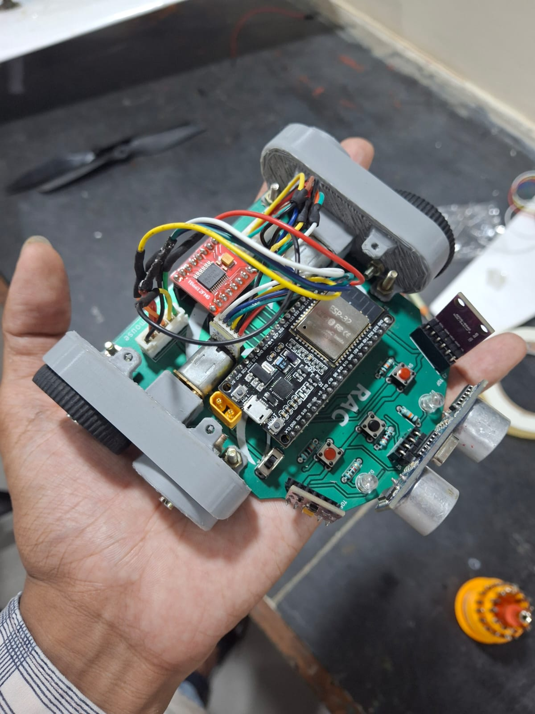
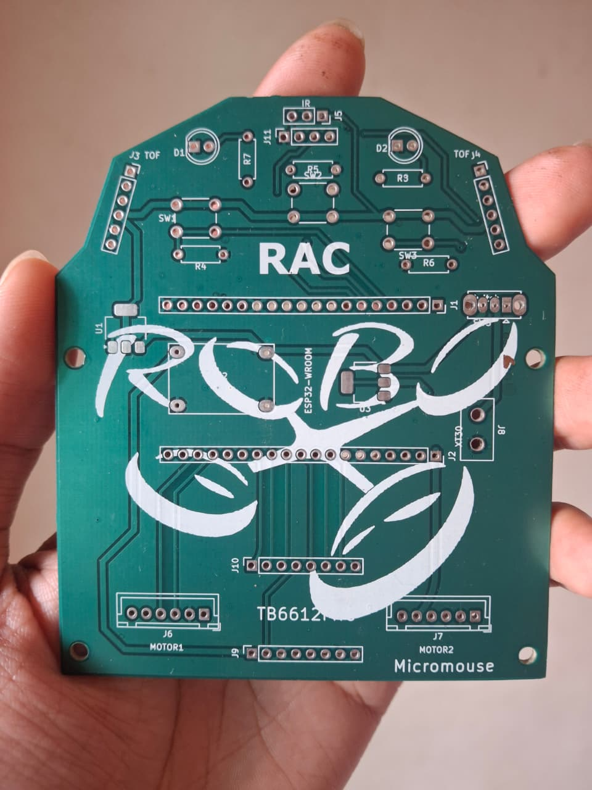
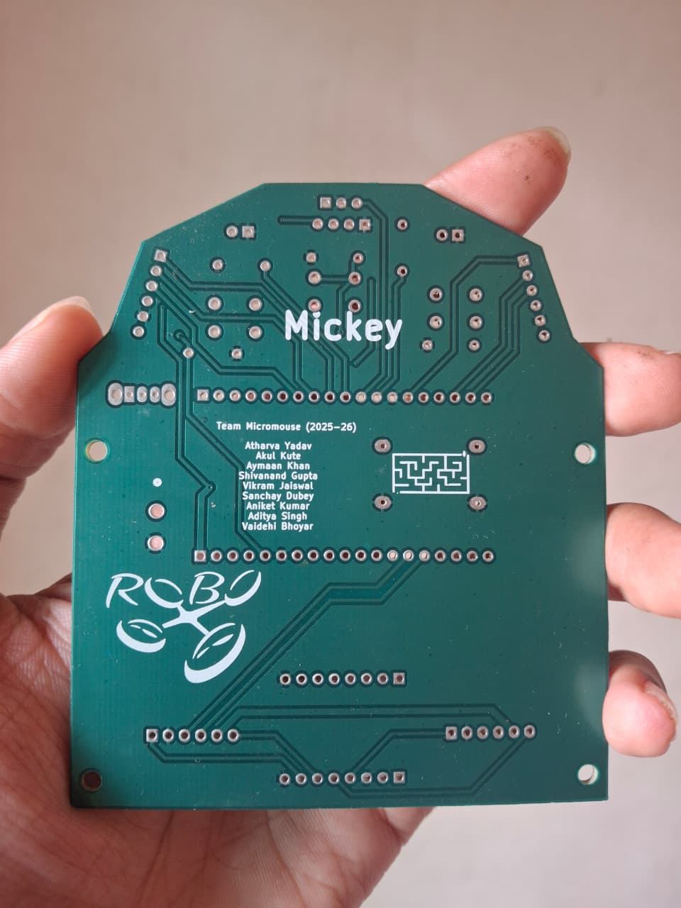
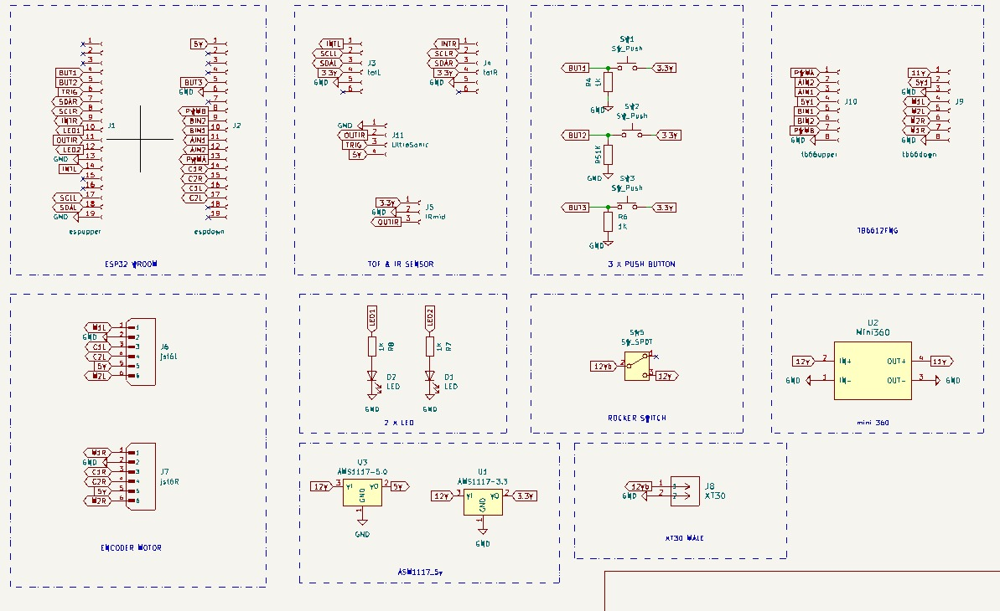

# 🐭 Mickey - High Performance Micromouse

  
   
  <i>Current iteration of [Mickey]</i>

## 📖 Overview

**[Mickey]** is an autonomous maze-solving robot designed for the **Technoxian WRC 25 and Robotex India National Championship** Micromouse competition. 

The goal is to navigate a 16x16 maze autonomously, map the walls, and find the fastest path from the start cell to the center. This repository contains the firmware, PCB designs, and mechanical CAD files required to build the mouse.

### 🌟 Key Features
* **Algorithm:** Flood-Fill
* **Controller:** ESP-32 WROOM DA Module
* **Movement:** PID-controlled differential drive with odometry.
* **Sensing:** IR Sensors and Ultrasconic Sensor.
* **Speed:** Capable of Dynamic speeds on straights.

---

## ⚡ Electronics & Hardware

### 🧩 System Architecture
The robot is built around a custom PCB that integrates power management, motor drivers, and sensor arrays.

<b>Click to view Circuit Diagram / Schematic</b>

 

<i>Full schematic available in the <code>hardware/</code> folder.</i>

### 🔋 PCB Design
The PCB was designed in KiCad. It is a 2-layer board with surface mount components.

| Top Layer | Bottom Layer | Schematic |
| :---: | :---: | :---: |
|  |  |  |

### 🛠 Bill of Materials (Highlights)

| Component | Part Name | Purpose |
| :--- | :--- | :--- |
| **Microcontroller** | ESP-32 WROOM DA MODULE | Main processing unit |
| **Motor Driver** | TB6612FNG | H-Bridge for DC motors |
| **IMU** | None | Can use Gyroscope for turning accuracy |
| **Sensors** | ADPS-9960 Peoximity Sensor | Wall distance measurement |
| **Motors** | N20 Micro Metal Gear | Drive train |
| **Battery** | 3s LiPo Battery | Power Source |

---
